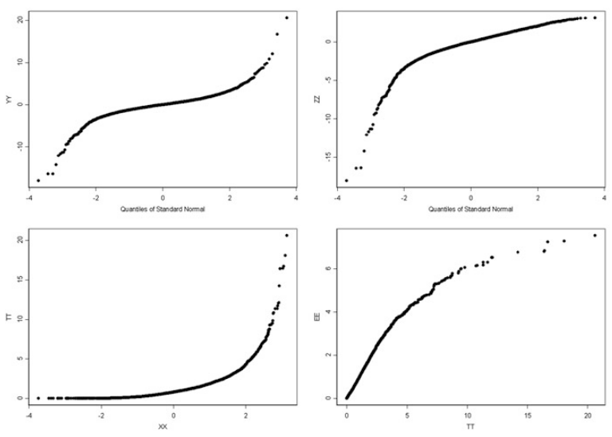

\vspace{0.25in}

# Problema 1.1

*Assuma que * $F_1(x)$ *e* $F_2(x)$ *são cdfs que satisfazem* $F_1(x) \leq F_2(x)$ *para todo* $x$. 

1. *Qual das duas distribuições tem cauda inferior mais pesada? Explique.*

**Resposta:** Suponha que ambas as distribuições se extendem para $-\infty$. Se $X_i \sim F_i(x), i=1,2$, sabemos que $P[X_2 \leq \pi^{(2)}_p] = p = P[X_1 \leq \pi^{(1)}_p] \leq P[X_2 \leq \pi^{(1)}_p] \implies \pi^{(1)}_p \geq \pi^{(2)}_p$, onde $\pi^{(i)}_p$ é função quantil das distribuições $F_i(x), i=1,2$. Podemos ver isso considerando o contrário. Nesse caso existiria um ponto nos intervalos de p-quantil possíveis que a desigualde oposta vale, porém isso afirmaria que em um subconjunto pequeno, a desigualdade inicial seria contradita, absudo. Desta maneira, o quantil da primeira distribuição vai mais devagar para $-\infty$ e, portanto, a segunda curva tem cauda inferior mais pesada.

2. *Qual das duas distribuições tem cauda superior mais pesada? Explique.*

**Resposta:** Suponha que ambas as distribuições se extendem para $\infty$. Pelo mesmo argumento utilizado na primeira pergunta, podemos observar que quando $p \to 1$, o quantil da primeira curva cresce mais rapidamente e, consequentemente, a primeira curva terá causa superior mais pesada. 

3. *Se estas duas distribuições são propostas para modelar o retorno de um dado portifolio no próximo mês e se você é perguntado para computar* $VaR_{0.01}$ *para este portifolio neste período, qual dessas duas distribuiçĩes resultaria o maior "value at risk"*. 

**Resposta:** Observe que se $P^i_{t+1} - P^i_{t}, i=1,2$ indica o retorno modelado pela distribuição 1 e 2, respectivamente. Assim 

$P[P^2_{t+1} - P^2_t < - VaR^2_p] = p = P[P^1_{t+1} - P^1_t < - VaR^1_p] \leq P[P^2_{t+1} - P^2_t < - VaR^1_p]$

Desta forma, como já observamos, $-VaR^2_p \leq -VaR^1_p \implies VaR_p^2 \geq VaR_p^1$ e obtemos que se calcularmos $VaR_p$ utilizando a segunda distribuição, ele terá um resultado maior. 

# Problema 1.2

1. *Em R, gere uma* $N = 1024$ *amostras da distribuição exponencial com taxa* $r = 0.2$ *. Chame* $X$ *o vetor com as amostras.* 
**Resposta:**

```{r}
# Gerando variável aleatória X:
X = rexp(n = 1024, rate = 0.2)
print(X[0:10])
```

2. *Plote no mesmo gráfico a densidade exata de* $X$ *e o histograma de* $X$.

**Resposta:**

```{r}
# Calculando o histograma
h <- hist(X, breaks = 30, freq = FALSE, col = 'red', 
          main = 'Comparing sample and theorical')

xfit <- seq(0, max(X),length= 50)
# Calculando a distribuição exponencial 
yfit <- dexp(xfit,rate = 0.2)

lines(xfit, yfit, col="blue", lwd = 2)
legend(25, 0.15, legend=c("Sample", "Theorical"),
       col=c("red", "blue"), fill = c('red', 'blue'), cex=0.8)

```

3. *Plote no mesmo gráfico a densidade exata de* $X$ *e uma estimativa da densidade kernel de* $X$.

```{r}
xfit <- seq(0, max(X),length= 40)

# A distribuição exponencial 
yfit <- dexp(xfit,rate = 0.2)
# A estimação da densidade kernel
yden <- density(X, bw = 0.5)
#Plotes
plot(yden$x, yden$y, col='red', xlim = c(1,max(X)), type = 'l', 
     main = "Comparing Kernel Estimation and Theoretical",
     xlab = "X", ylab = "Density")
lines(xfit, yfit, col="blue", lwd = 2)

legend(20, 0.15, legend=c("Kernel Estimation", "Theorical"),
       col=c("red", "blue"), lty=1:1, cex=0.8)
```

4. *Compare os dois plotes e explique as razões das diferenças. Diga qual estimativa você prefere, e explique porquê.*

**Resposta:**  Observe que tanto o histograma quanto a estimação kernel da densidade se utilizam dos $N$ dados. O histograma pode ser escrito em forma de uma função kernel, só que uma descontínua, já que tem um valor caso $x$, o valor da função, e $x_i$, uma amostra, estão no mesmo bin, e $0$ caso não estejam. No caso da estimação kernel, essa diferença é suave, bastando escolher uma função suave. Os saltos da aproximação no caso do histograma é determinado pelo número de bins, enquanto no caso da estimação kernel é o parâmetro "bandwidth", logo podemos ter uma função tão suave quanto queremos. Desta maneira, é preferível essa estimação kernel, pois suavizamos a função e podemos obter resultados mais precisos com a densidade almejada. 

# Problem 1.3

*Dê a interpretação de cada um dos seguintes Q-Q-plots*



**Resposta:**

1. Observe quando $p \to 0$, o plote está abaixo da diagonal, o que significa que a distribuição Normal tem cauda menos pesada do que a YY, pois a função quantil está mais lenta ao tender a $-\infty$. No mesmo sentido, quando $p \to 1$, a curva fica acima da diagonal, logo a função quantil de YY cresce mais rápido, e ela tem curva superior mais pesada. Além disso, a escala dos dois eixos é muito diferente. 

2.  Temos uma distribuição onde os q-quantis estão em grande parte na parte negativa, logo já podemos observar que essa distribuição esta deslocada para os valores negativos e, portanto, tem cauda mais pesada do que a Normal. O mesmo ocorre quando $p \to 1$, visto que o plote também está abaixo da diagonal. Assim, imagina-se qua distribuição tenha se deslocado para a esquerda e a normal tenha ficado com cauda mais pesada na parte superior. 

3. Esse caso é oposto ao 2, o gráfico está quase todo a cima da diagonal, o que indica que quando $p \to 0$, a cauda da distribuição XX é mais pesada do que TT. Isso também é corroborado com o fato de TT ser uma distribuição com suporte positivo, pelo menos sua grande parte de área. Entretanto, quando $p \to 1$, a distribuição de TT terá curva mais pesada, analogamente. 

4. Neste último caso, vemos duas distribuições em suma com suporte positivo. A escala dos eixos, como de todas as anteriores, são bem diferentes. Nesse caso, a diagonal emcobre toda a curva, mas não faz tanto sentido em falar cauda inferior mais pesada. Já quando $p \to 1$, a distribuição TT é mais rápida, o que siginifica que ela é uma distribuição com cauda superior mais pesada. 

# Problema 1.4

1. *Articule propriedades das distribuições XX e YY que você pode inferir com esses plotes.*


**Resposta:** 

- Distribuição XX: Primeiro podemos inferir que a escala da distribuição é similar a da normal, com alta probabilidade. Quando $p \to 0$, a curva está acima da reta $y = x$, logo podemos inferir que a distribuição normal tem cauda inferior mais pesada do que a distribuição em questão. Também podemos inferir que quando $p \to 1$, pela curva estar a cima da curva $y = x$, corrobora com o fato da distribuição ter cauda superior mais pesada do que a normal. (Observo que a reta plotada **não** é $y=x$.). Também podemos inferir que a distribuição esta concentrada em torno do quantil $-2$, já que quase metade metade da área da normal está concentrada ao redor desse ponto. 

- Distribuição YY: Nesse caso já vemos uma grande diferença de escala das duas distribuições, o que indica que a normal é mais concentrada do que a distribuição $YY$. Também observamos que a cauda da da distribuição YY é mais pesada, tanto na parte inferior quando na parte superior. Por fim, observe que através da reta descrita no gráfico, existe um intervalo em que a curva pode ser praticamente descrita por uma reta. Isto significa que ao dobrar o quantil da normal, com a mesma área, dobraremos o quantil da distribuição, logo elas são semelhantes nessa intervalo, dada uma transformação linear. 

2. *Agora assuma que* $x_1, x_2, ..., x_m$ *e* $y_1,y_2,...,y_n$ *são amostras univariadas de possivelmente duas distribuições diferentes. Em cada uma das seguintes situações, desenhe o Q-Q plote de Y contra X como dado pelo comando qqplot(X,Y) quando:*

```{r}
X = rlnorm(10000, 0, 1)
Y1 = rcauchy(10000, 0, 1)
Y2 = rnorm(10000, 0, 1)
```

2.1 $x_1, x_2, ..., x_m$ *é uma amostra da distribuição log-normal* $LN(0,1)$, *e* $y_1, y_2, ..., y_n$ *é uma amostra da distribuição de Cauchy* $C(0,1)$. 

**Resposta:**
```{r}
qqplot(X,Y1, 
       main = 'Q-Q Plot de C(0,1) contra LN(0,1)', 
       col = 'red', pch = 16, cex = 0.5)
x <- seq(min(X), max(X), 0.01)
lines(x,x)
```

2.2 $x_1, x_2, ..., x_m$ *é uma amostra da distribuição log-normal* $LN(0,1)$, *e* $y_1, y_2, ..., y_n$ *é uma amostra da distribuição de Gaussiana* $N(0,1)$. 

**Resposta:**
```{r}
qqplot(X,Y2,  
       main = 'Q-Q Plot de N(0,1) contra LN(0,1)', 
       col = 'blue', pch = 16, cex = 0.5)
lines(x,x)
```
  
# Problema 1.9

*O objetivo deste problema é desenvolver e usar um gerador de números aleatórios caseiro para a distribuição exponencial. Paraaa primeira questão desse proble, você não é permitiido para usar qualquer das função exp.*

1. *Lembre a fórmula da cdf* $F_{\lambda}(x) = P[X \leq x]$ *de uma variável aleatória* $X$ *com uma distribuição exponencial de parâmetro* $\lambda$. *Escreva uma função R myrexp que recebe os parâmetros N e LAMBDA e retorna um vetor numérico de tamanho N contendo N amostras da variável aleatória da distribuição exponencial*

**Resposta:**

```{r}
# Lembrando da CDF da Distribuição Exponencial
F <- function(x, r){
  return <-  1 - exp(-r*x)
}
# Construindo a função inversa da CDF
invF <- function(x,r){
    return <- -1/r*log(1 - x)
}
# Construindo minha função rexp. 
myrexp <- function(N, LAMBDA = 1){
  # Gero uma variável uniforme e utilizo a universalidade da Uniforme. 
  U = runif(n = N, min = 0, max = 1)
  return <- invF(U,r = LAMBDA)
}
```

2. *Use sua função myrexp para gerar uma amostra de tamanho* $N=1024$ *da distribuição exponencial com média* $1.5$, *use a função do R para gerar uma amostra de tamanho 2N e produza o Q-Q Plot das amostras. Você está satisfeito com a performace da simulação da função? Explique porquê.* 

**Resposta:** Estou satisfeito com a performace por dois motivos: Ele é embasado em conceitos matemáticos de probabilidade: Universalidade da Amostra. E também porque graficamente, a curva ficou muito próxima a reta $y=x$, o que indica que as distribuições são com alta probabilidade equivalentes, como vemos no gráfico abaixo. 

```{r}
# Gerando uma amostra aleatória
# Se a média é 1.5, a taxa é 1/1.5
X = myrexp(N = 1024, LAMBDA = 1/1.5)
Y = rexp(n = 2*1024, rate = 1/1.5)

#Plotting Q-Q Plot
qqplot(X,Y, col = 'green', pch = 16, cex = 0.5, 
       main = 'Q-Q Plot da função rexp (R) contra a função myrexp (Pessoal)')
lines(seq(min(X,Y), max(X,Y), 0.01),seq(min(X,Y), max(X,Y), 0.01))
```
